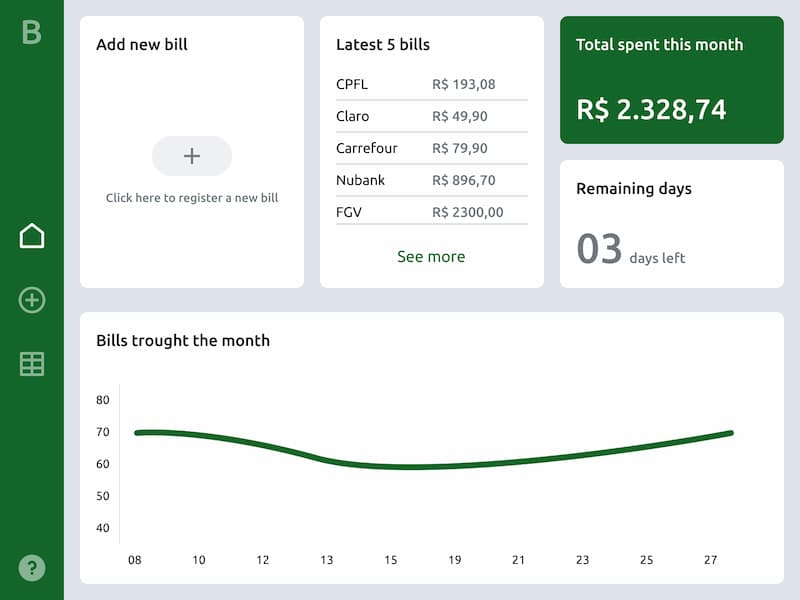

# Bills

Bills is a simple desktop application to help you visualize through data visualizations and tables, how much and how you are spending your money. 



This application was build on top of the [Webview](https://github.com/webview/webview) project, using Go to handle logic and React for the UI.


## Installation

First install [Go 1.16+](https://golang.org/doc/install)

After that, clone this project to your machine.

```bash
git clone https://github.com/afonsolopez/bills.git
```

Install if you're running OpenBSD, FreeBSD or Ubuntu "webkit2gtk" as the webview docs says. As I am running Xubuntu 20.04 on my machine this following package worked fine.

```bash
sudo apt-get install libwebkit2gtk-4.0-dev
```
Fetch all the dependencies

```go
go mod tidy
```

## Usage

```bash
# Open the cloned project folder
cd bills

# Clean the project, build the React app, compiles the code and runs the app.
make

# Just cleans older builds
make clean

# Builds the React app
make build

# Builds the app without fetching React app dependencies
make test

# Compiles the app
make compile

# Runs the compiled app
make run
```

## Contributing
Pull requests are welcome. For major changes, please open an issue first to discuss what you would like to change.

## License
[GNU General Public License v3.0](https://choosealicense.com/licenses/gpl-3.0/)